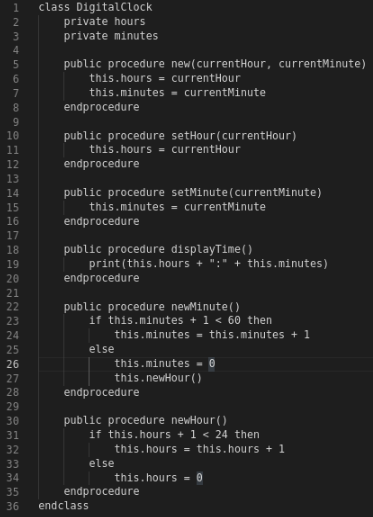
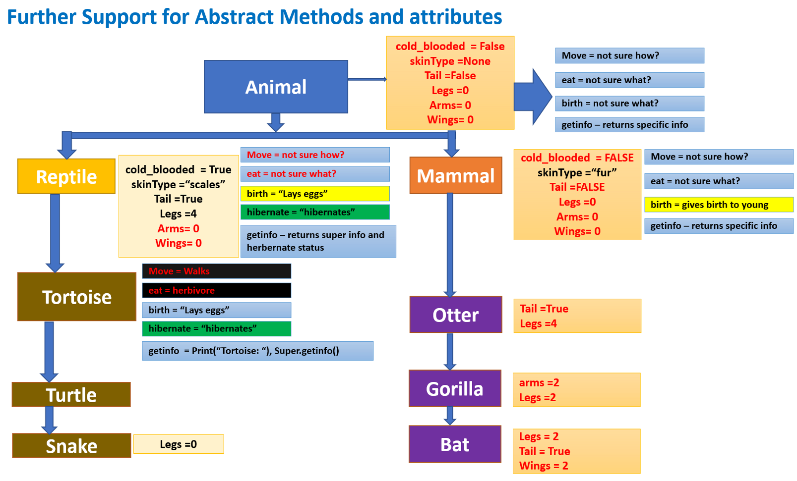
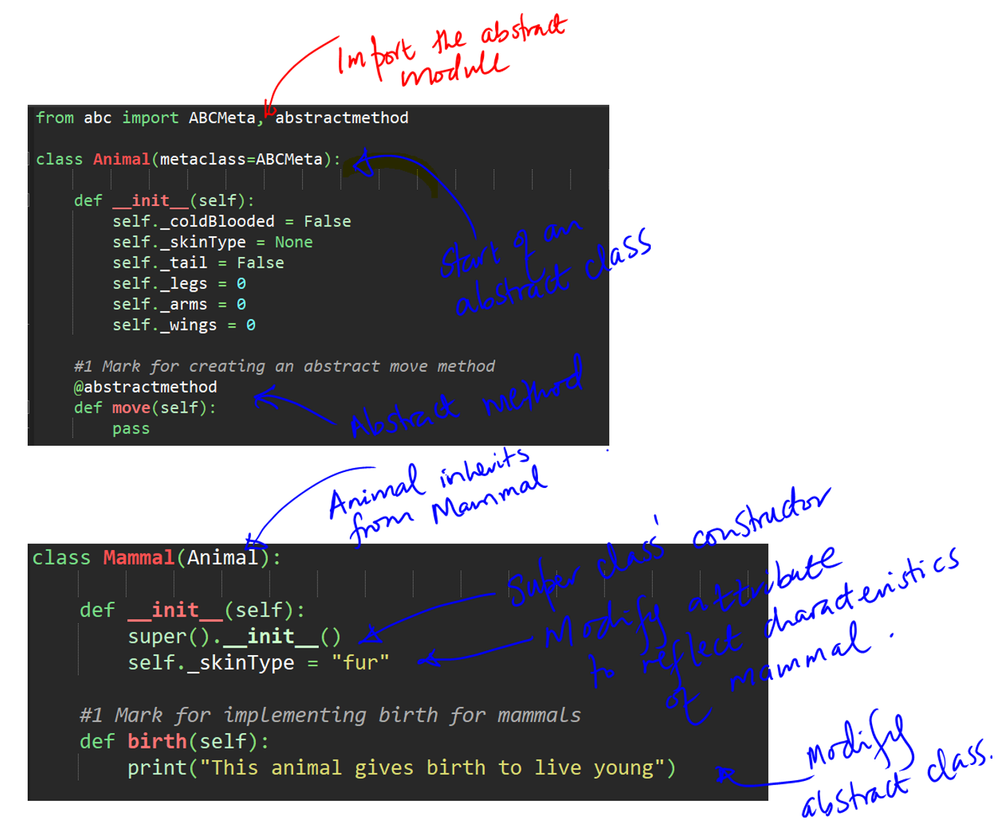

# oop-ALevel
OOp Principles A Level 

### Task 1 - This is the very first Task 

Students are required to Use pseudocode to write a class with relevant attributes and methods to represent a digital clock object. It should represent the time as a 24 hour clock, and include methods to: create a new object, set the time manually, display the time, and update the time at the end of each minute.

### Extension
- Add functionality so that the clock automatically displays from the starting minute and hour
- Add functionality so that the clock now has changing seconds.

### Task 2 - OOP Programming Activity 1 - The Bank Task

This Activity uses Skeleton code [OOP_Activity1_Skeleton_Code](OOP_Activity1_skeleton_Code.py) is part of a program that allows a user to create a bank account, login to their account, check their balance and deposit or withdraw money from their account. 

It defines an account class, that stores information about the 

individual bank accounts, and a Bank class, that holds all of the Bank accounts and performs operations on individual accounts when asked to by the user.  
 
Add the missing attributes and method logic to the Activity 1 Skeleton Code to complete its functionality. No changes should be made to main, no new methods should be defined, and the parameters that the methods use should not be changed, deleted or added to. 

### Task 3 - Encapsulation - Demonstrate understanding and implementation of encapsulation
The Activity 2 Skeleton Code is a system that manages a hotel and its staff.  You have been provided with 2 files 
- [Activity 2 - Encapsulation Skeleton Code](Activity2_Encapsulated%20Skeleton.py)

- [Activity 2 - None Encapsulated code](Activity2_None-Encapsulated.py)

Customers are checked in and out of their rooms, and leave feedback depending on how their stay was (if they are successfully checked in or their room is clean they become happier with their stay, and if their room is overbooked or unclean they become less happy with their stay). 

Recreate the Activity 2 Non-Encapsulated code so that it keeps the same functionality but is properly encapsulated.  

There should be classes for: Hotel, Room, Customer, Manager, Receptionist and Cleaner.  

The manager should be responsible for processing feedback, the cleaner should be responsible for cleaning rooms, and the receptionist should be responsible for checking customers in and out of their rooms.  

All attributes should be made private (although you may add any methods that you think are helpful). 

You may use the provided Activity 2 Encapsulated Skeleton code, which provides a converted main method and constructors for each class that do not need to be altered. 

### Task 4 - Inheritance and Abstract methods
- The code template provides contains classes for various animals, describing what attributes they have and what actions they can do.

- The task is to do the following:
1. Keep  the functionality of the code i.e. produces the same output
2. Add 3 additional classes - Animal, Reptile  and Mammal
3. The Animal class should include abstract methods
4. Classes should inherit from other classes as appropriate, and as much functionality as possible should be moved to the 3 new classes
5. The main method should not be altered.
- 
- 
- [Main code template](Activity4_SkeletonCode.py)

## Additional Inheritance tasks

### Electric Car:
  Create an ElectricCar class which inherits from the car class we created in "The Cars" task.  Test it by creating an instance of an electric car e.g. ("tesla", "Model S", 2019).  Call the descriptive_name() method on this new instance.

Add the attribute battery_size  to the ElectricCar class.  Add a method describe_battery() which prints out a description of the electric car's battery in kwh e.g. "This car has a 75 kwh battery". Test this method by calling it on the instance  of ElectricCar.

Add a method fill_gas_tank() to ElectricCar.  It should override the parent method as the electric car does not have a gas tank.  It should print an appropriate message when called.  Test is by trying to fill the ElectricCar instance with gas.

Now try and use the battery instance as an attribute in the car class by following the steps below:
	i) Create a Battery class passing in the battery_size=75 as an attribute into the constructor
	ii) Move the describe_battery() method into the Battery class
	iii) Now create a battery attribute in the car class and set it as an instance of the Battery class.
iv)  Now test the instance of ElectricCar by calling a describe_battery() method on it.

Extend the Battery Class by adding a method get_range(), this method has the logic of determining the range based on the size of the battery.  A 75kwh battery has a range of 260 miles and a 100 kwh battery has a range of 315 miles. Test the code with the correct data to output the following:
"2019 Tesla Model S
This car has a 75-kwh battery
This car can go about 260 miles on full charge"

### Ice Cream Stand: 
An ice cream stand is a special kind of restaurant.  Write a class called IceCreamStand that inherits from the restaurant  class you wrote earlier.  Either version of the class will work.  Add an attribute called flavours that stores a list of flavours.  Write a method that displays these flavours.  Create an instance of IceCreamStand and call this method.

### Admin: 
An administrator is a special kind of User.  Write a class called Admin  that inherits from the user class you wrote in an earlier exercise.  Add an attribute, privileges, that stores a list of strings like "can add a post", "can delete a post", "can ban a user", and so on.  Write a method called show_privileges() that lists the administrator's set of privileges.  Create and instance of Admin and call your method.

### Privileges: 
Write a separate Privileges class.  The class should have one attribute, privileges, that stores a list of strings as described in the Admin task above.  Move the show_privileges() method to this class.  Make a privileges instance as an attribute in the Admin class.  Create a new instance of Admin and use your method to show its privileges.
 
